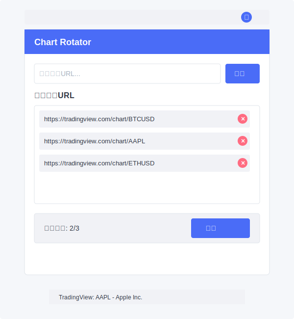

# Chart Rotator

一个Chrome浏览器扩展，用于在同一个标签页内自动轮播多个股票或加密货币图表。

## 🌟 功能特点

- 🔄 自动轮换显示不同的图表URL，可自定义轮播间隔时间
- 📝 自定义标的名称和URL
- 🔧 支持URL编辑功能，无需删除重新添加
- 📊 支持所有可通过URL访问的图表（TradingView、交易所等）
- 📂 分组管理功能，支持创建多个分组并设置显示频率
- 🎯 高级优先级系统，高频分组可以优先显示
- 🔒 仅限当前标签页轮播，不影响其他标签页
- ⏯️ 轮播控制：开始/暂停/下一个/停止
- ⏱️ 显示倒计时，方便了解何时切换到下一个图表
- 🖱️ 支持拖拽定位和位置记忆的悬浮窗

## 📥 安装方法

### 方法一：直接下载CRX文件（最简单）

1. 从 [Releases页面](https://github.com/kwin-wang/chart-rotator/releases) 下载最新的`chart-rotator.crx`文件
2. 打开Chrome浏览器，转到`chrome://extensions/`
3. 开启"开发者模式"（右上角的开关）
4. 将下载的CRX文件拖放到扩展页面上
5. 确认安装

### 方法二：从源代码安装

1. 下载或克隆此仓库
   ```
   git clone https://github.com/kwin-wang/chart-rotator.git
   ```
2. 打开Chrome浏览器，转到`chrome://extensions/`
3. 开启"开发者模式"（右上角的开关）
4. 点击"加载已解压的扩展程序"
5. 选择仓库文件夹即可

## 🔧 使用说明

1. 点击浏览器工具栏中的Chart Rotator图标
2. 在弹出窗口中输入标的名称和图表URL，选择分组
3. 点击"添加"按钮将其添加到列表中
4. 添加完所有需要监控的图表后，点击"开始"按钮
5. 插件将在当前标签页中自动轮换显示不同的图表
6. 需要暂停时点击"暂停"按钮，需要手动切换时点击"下一个"按钮
7. 点击"设置"链接可进入设置页面，管理分组和URL

### 🔍 分组管理

1. 在设置页面中创建分组，设置显示频率
2. 频率越小的分组优先级越高（例如30分钟比60分钟优先级高）
3. 频率为0的分组进行连续轮播（最低优先级）
4. 高优先级分组可在当前URL播放完成后"插队"显示

### ✏️ 编辑URL

1. 点击URL项目右侧的编辑按钮
2. 在弹出的对话框中修改名称和/或地址
3. 点击"保存"按钮应用更改

## 📷 截图



## 🛠️ 开发者信息

构建状态：

本扩展使用纯JavaScript开发，无需任何外部依赖。

### 构建自己的版本

1. Fork 本仓库
2. 修改代码
3. 通过GitHub Actions自动构建CRX文件，或手动执行：
   ```
   openssl genrsa -out key.pem 2048
   crx3-utils pack -o chart-rotator.crx -p key.pem .
   ```

## 📝 许可证

[MIT License](LICENSE)

## 🙏 贡献指南

欢迎提交问题和贡献代码！请查看[贡献指南](CONTRIBUTING.md)了解更多信息。